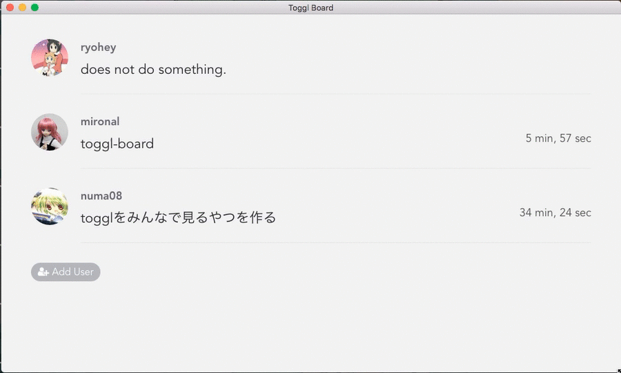

 

# Toggl Board

Desktop Application to show your team member's [toggl](https://toggl.com/) status.

# Installation

## Download Application

There is newest build application.

Please download the binary file for your architecture.

 
 
## Run

Insert you and your team member's [Toggl API TOKEN](https://toggl.com/app/profile)

# License

MIT
